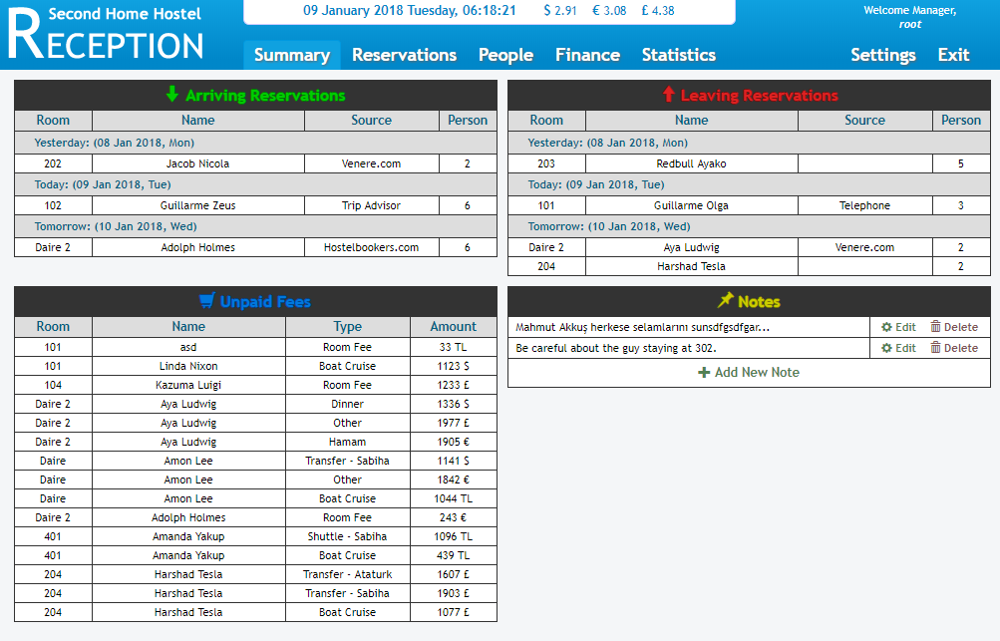
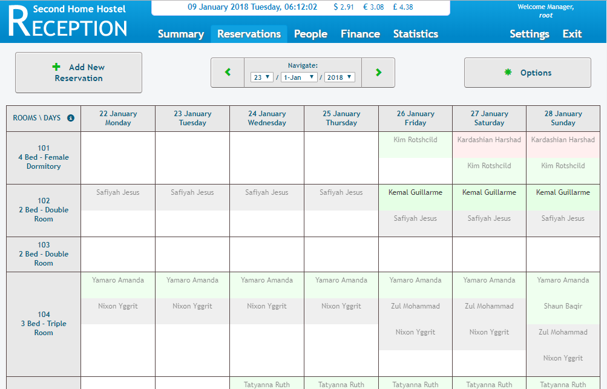
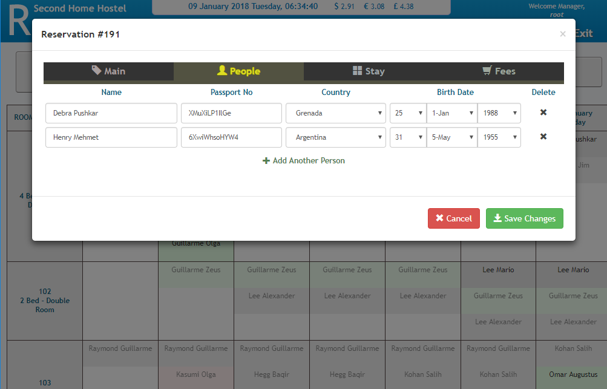
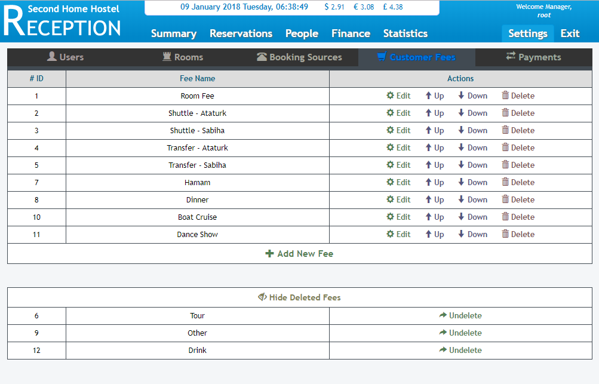

# HostelReception

A web based hostel reception management system that I made while working as night receptionist in 2013. And then developed it some more in 2014.

Hostels do not work systematically like hotels do. They can have dormitory rooms, where multiple reservations occupy the
same room. They can have hotel rooms, where only one reservation stays in a room, but sometimes they use that room a dormitory too.
They sometimes expand and add new rooms. Sometimes they have to remove some rooms. Sometimes, they change the room their customers staying in, in order to be able to fill the hostel as much as possible.

For this reason, multiple reservations can stay in a room in this reception management system. And a reservation can stay in different rooms across their accommodation time.
Rooms can be added, or deleted (if there are no future reservations), and then undeleted again. Past reservation data do not get lost.

Everything is thought out and this system has all the necessary stuff an hostel registry must have.
Apart from that, system has a nice summary panel, where receptionist can see expected arrivals, departures, unpaid fees, and notes pinned by other receptionist.
Payment amounts can be added in TL, $, €, or £, as touristic places need to work with many different currencies.

Being a web based application, it works on all platforms, and accessible from anywhere.

## How to set it up?
* Create the MySQL database with the given .sql file.
* Modify the necessary places in the code for the database credentials: 
```
@ Class/1_Recaptcha.php
#PubKey#		-> reCAPTCHA public key
#PrivKey#		-> reCAPTCHA private key

@ Class/11_Control.php:
#DBserver#		-> Database server adress.
#DBuser#		-> Database username.
#DBpass#		-> Database password.
#DBname#		-> Database name.

@ Javascript/HMS_System.js:
http://localhost/	-> Root address of the website

@ Javascript/HMS_Designer.js
#PubKey#		-> reCAPTCHA public key
```
* Put all the files to your server, everything works correctly with the PHP version 5.3.26.
* Create a Linux cronjob for the "Cron/update-currency.php" script.
* Default user is "root", password is "1".
* "dbadd.php" script can used to fill the registry with fake reservations. Can be used for testing.

## TO DO List (I'm not working on it):
 * Add "People" page, where list of every people stayed in the hostel can be seen, and can be searched.
 * Add "Finance" page, where list of every monetary income can be seen, and various periodic reports automatically generated.
 * Add "Statistics" page, where some detailed statistics can be seen.
 * Fix the cronjob script that updates foreign currency rates periodically. It was working till 2016, when the information source changed the way they present the information.
 * Store currency rates daily, so that more detailed financial reports can be generated in the future.
 * ... Think of more improvements.
 
## Here is some screenshots:








